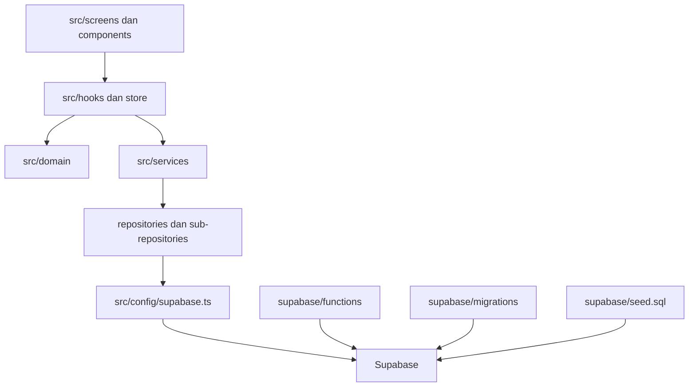

# Package Diagram

```mermaid
flowchart TD
    Screens[src/screens dan components] --> Hooks[src/hooks dan store]
    Hooks --> Domain[src/domain]
    Hooks --> Services[src/services]
    Services --> Repositories[repositories dan sub-repositories]
    Repositories --> Client[src/config/supabase.ts]
    Client --> Cloud[Supabase]
    Functions[supabase/functions] --> Cloud
    Migrations[supabase/migrations] --> Cloud
    Seed[supabase/seed.sql] --> Cloud
```

Service proyek memisahkan query, command, tahapan, dan berkas. Booking memiliki repository sendiri. Auth dan notifikasi memakai service yang terhubung ke Supabase.
