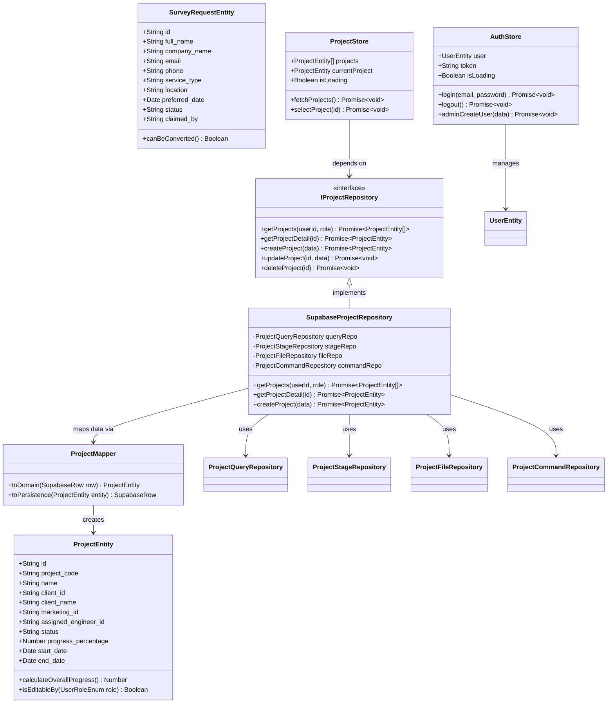

# UML: Class Diagram
## Proyek: GSI One Mobile Application & Supabase

Menggambarkan struktur kelas OOP Domain Entities, Repositories, Facades, Mappers, dan Zustand Stores.

```mermaid
classDiagram
    class ProjectEntity {
        +String id
        +String project_code
        +String name
        +String client_id
        +String client_name
        +String marketing_id
        +String assigned_engineer_id
        +String status
        +Number progress_percentage
        +Date start_date
        +Date end_date
        +calculateOverallProgress() Number
        +isEditableBy(UserRoleEnum role) Boolean
    }

    class SurveyRequestEntity {
        +String id
        +String full_name
        +String company_name
        +String email
        +String phone
        +String service_type
        +String location
        +Date preferred_date
        +String status
        +String claimed_by
        +canBeConverted() Boolean
    }

    class IProjectRepository {
        <<interface>>
        +getProjects(userId, role) Promise~ProjectEntity[]~
        +getProjectDetail(id) Promise~ProjectEntity~
        +createProject(data) Promise~ProjectEntity~
        +updateProject(id, data) Promise~void~
        +deleteProject(id) Promise~void~
    }

    class SupabaseProjectRepository {
        -ProjectQueryRepository queryRepo
        -ProjectStageRepository stageRepo
        -ProjectFileRepository fileRepo
        -ProjectCommandRepository commandRepo
        +getProjects(userId, role) Promise~ProjectEntity[]~
        +getProjectDetail(id) Promise~ProjectEntity~
        +createProject(data) Promise~ProjectEntity~
    }

    class ProjectMapper {
        +toDomain(SupabaseRow row) ProjectEntity
        +toPersistence(ProjectEntity entity) SupabaseRow
    }

    class AuthStore {
        +UserEntity user
        +String token
        +Boolean isLoading
        +login(email, password) Promise~void~
        +logout() Promise~void~
        +adminCreateUser(data) Promise~void~
    }

    class ProjectStore {
        +ProjectEntity[] projects
        +ProjectEntity currentProject
        +Boolean isLoading
        +fetchProjects() Promise~void~
        +selectProject(id) Promise~void~
    }

    IProjectRepository <|.. SupabaseProjectRepository : implements
    SupabaseProjectRepository --> ProjectQueryRepository : uses
    SupabaseProjectRepository --> ProjectStageRepository : uses
    SupabaseProjectRepository --> ProjectFileRepository : uses
    SupabaseProjectRepository --> ProjectCommandRepository : uses
    SupabaseProjectRepository --> ProjectMapper : maps data via
    ProjectMapper --> ProjectEntity : creates
    ProjectStore --> IProjectRepository : depends on
    AuthStore --> UserEntity : manages
```
