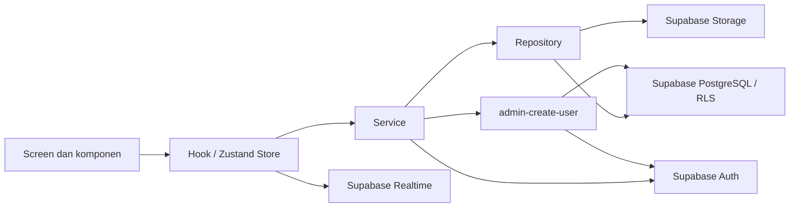

# UML: Component Diagram

```mermaid
flowchart LR
    UI[Screen dan komponen] --> State[Hook / Zustand Store]
    State --> Service[Service]
    Service --> Repo[Repository]
    Repo --> DB[Supabase PostgreSQL / RLS]
    Service --> Auth[Supabase Auth]
    Service --> Function[admin-create-user]
    Repo --> Storage[Supabase Storage]
    State --> Realtime[Supabase Realtime]
    Function --> Auth
    Function --> DB
```

Definisi database berada di `supabase/migrations/`, data demo di `supabase/seed.sql`, dan fungsi privileged di `supabase/functions/`.
