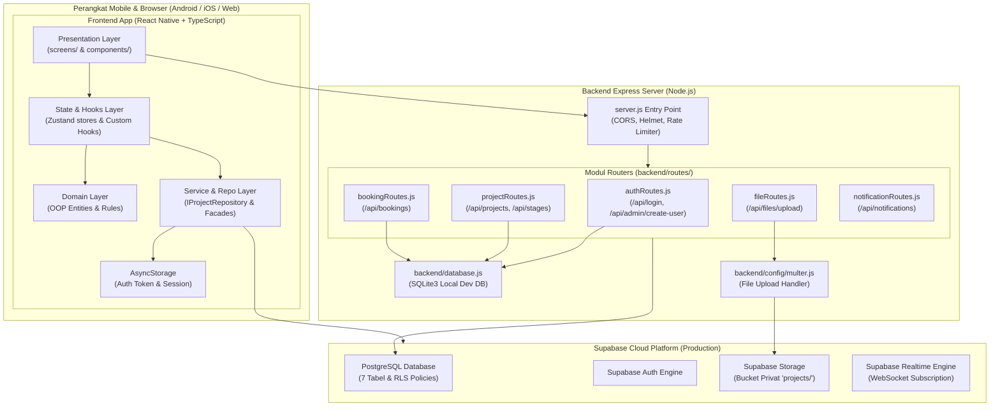

# UML: Component Diagram
## Proyek: GSI One Mobile Application & Express Backend API

Menggambarkan komponen-komponen perangkat lunak frontend, backend routers, middleware, dan external services.

```mermaid
graph TB
    subgraph ClientDevice["Perangkat Mobile & Browser (Android / iOS / Web)"]
        subgraph FrontendApp["Frontend App (React Native + TypeScript)"]
            Presentation["Presentation Layer\n(screens/ & components/)"]
            StateHooks["State & Hooks Layer\n(Zustand stores & Custom Hooks)"]
            DomainLayer["Domain Layer\n(OOP Entities & Rules)"]
            ServiceRepo["Service & Repo Layer\n(IProjectRepository & Facades)"]
            LocalStore["AsyncStorage\n(Auth Token & Session)"]
        end
    end

    subgraph ServerNode["Backend Express Server (Node.js)"]
        ServerCore["server.js Entry Point\n(CORS, Helmet, Rate Limiter)"]
        
        subgraph Routers["Modul Routers (backend/routes/)"]
            AuthRoute["authRoutes.js\n(/api/login, /api/admin/create-user)"]
            ProjRoute["projectRoutes.js\n(/api/projects, /api/stages)"]
            BookRoute["bookingRoutes.js\n(/api/bookings)"]
            FileRoute["fileRoutes.js\n(/api/files/upload)"]
            NotifRoute["notificationRoutes.js\n(/api/notifications)"]
        end

        DBAdapter["backend/database.js\n(SQLite3 Local Dev DB)"]
        MulterMiddleware["backend/config/multer.js\n(File Upload Handler)"]
    end

    subgraph CloudBaaS["Supabase Cloud Platform (Production)"]
        SupaPostgres["PostgreSQL Database\n(7 Tabel & RLS Policies)"]
        SupaAuth["Supabase Auth Engine"]
        SupaStorage["Supabase Storage\n(Bucket Privat 'projects/')"]
        SupaRealtime["Supabase Realtime Engine\n(WebSocket Subscription)"]
    end

    Presentation --> StateHooks
    StateHooks --> DomainLayer
    StateHooks --> ServiceRepo
    ServiceRepo --> LocalStore
    Presentation --> ServerCore
    ServiceRepo --> CloudBaaS

    ServerCore --> Routers
    AuthRoute --> DBAdapter
    ProjRoute --> DBAdapter
    BookRoute --> DBAdapter
    FileRoute --> MulterMiddleware
    MulterMiddleware --> SupaStorage
    Routers --> SupaPostgres
```
