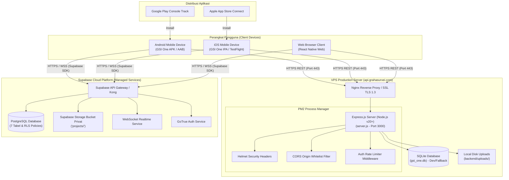

# UML: Deployment Diagram
## Proyek: GSI One Mobile Application & Backend Infrastructure

Menggambarkan penyebaran fisik komponen sistem pada infrastruktur produksi.

```mermaid
graph TB
    subgraph ClientDevices["Perangkat Pengguna (Client Devices)"]
        AndroidDevice["Android Mobile Device\n(GSI One APK / AAB)"]
        iOSDevice["iOS Mobile Device\n(GSI One IPA / TestFlight)"]
        WebBrowser["Web Browser Client\n(React Native Web)"]
    end

    subgraph DistributionStore["Distribusi Aplikasi"]
        PlayStore["Google Play Console Track"]
        AppStore["Apple App Store Connect"]
    end

    subgraph VPSProduction["VPS Production Server (api.grahasurvei.com)"]
        NginxProxy["Nginx Reverse Proxy / SSL TLS 1.3"]
        
        subgraph PM2Cluster["PM2 Process Manager"]
            ExpressNode["Express.js Server (Node.js v20+)\n(server.js - Port 3000)"]
            HelmetModule["Helmet Security Headers"]
            CorsModule["CORS Origin Whitelist Filter"]
            RateLimitModule["Auth Rate Limiter Middleware"]
        end

        LocalDB[("SQLite Database\n(gsi_one.db) - Dev/Fallback")]
        LocalStorageDir["Local Disk Uploads\n(backend/uploads/)"]
    end

    subgraph SupabaseCloudProd["Supabase Cloud Platform (Managed Services)"]
        SupaGateway["Supabase API Gateway / Kong"]
        PostgreSQLDB[("PostgreSQL Database\n(7 Tabel & RLS Policies)")]
        StorageBucket["Supabase Storage Bucket Privat\n('projects/')"]
        RealtimeEngine["WebSocket Realtime Service"]
        AuthEngine["GoTrue Auth Service"]
    end

    PlayStore -->|Install| AndroidDevice
    AppStore -->|Install| iOSDevice

    AndroidDevice -->|"HTTPS REST (Port 443)"| NginxProxy
    iOSDevice -->|"HTTPS REST (Port 443)"| NginxProxy
    WebBrowser -->|"HTTPS REST (Port 443)"| NginxProxy

    NginxProxy --> ExpressNode
    ExpressNode --> HelmetModule
    ExpressNode --> CorsModule
    ExpressNode --> RateLimitModule
    ExpressNode --> LocalDB
    ExpressNode --> LocalStorageDir

    AndroidDevice -->|"HTTPS / WSS (Supabase SDK)"| SupaGateway
    iOSDevice -->|"HTTPS / WSS (Supabase SDK)"| SupaGateway
    WebBrowser -->|"HTTPS / WSS (Supabase SDK)"| SupaGateway

    SupaGateway --> PostgreSQLDB
    SupaGateway --> StorageBucket
    SupaGateway --> RealtimeEngine
    SupaGateway --> AuthEngine
```
