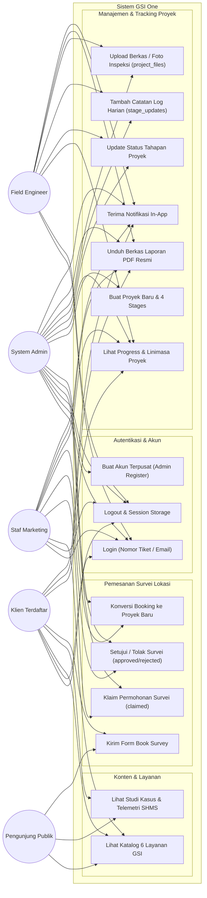

# UML: Use Case Diagram
## Proyek: GSI One Mobile Application & Supabase

Menggambarkan seluruh aktor dan use case yang tersedia dalam ekosistem GSI One.

```mermaid
graph LR
    Public(("Pengunjung Publik"))
    Client(("Klien Terdaftar"))
    Engineer(("Field Engineer"))
    Marketing(("Staf Marketing"))
    Admin(("System Admin"))

    subgraph GSI_One["Sistem GSI One"]
        subgraph AuthMod["Autentikasi & Akun"]
            UC1["Login (Nomor Tiket / Email)"]
            UC2["Buat Akun Terpusat (Admin Register)"]
            UC3["Logout & Session Storage"]
        end
        subgraph ContentMod["Konten & Layanan"]
            UC4["Lihat Katalog 6 Layanan GSI"]
            UC5["Lihat Studi Kasus & Telemetri SHMS"]
        end
        subgraph BookingMod["Pemesanan Survei Lokasi"]
            UC6["Kirim Form Book Survey"]
            UC7["Klaim Permohonan Survei (claimed)"]
            UC8["Setujui / Tolak Survei (approved/rejected)"]
            UC9["Konversi Booking ke Proyek Baru"]
        end
        subgraph ProjectMod["Manajemen & Tracking Proyek"]
            UC10["Buat Proyek Baru & 4 Stages"]
            UC11["Lihat Progress & Linimasa Proyek"]
            UC12["Update Status Tahapan Proyek"]
            UC13["Tambah Catatan Log Harian (stage_updates)"]
            UC14["Upload Berkas / Foto Inspeksi (project_files)"]
            UC15["Unduh Berkas Laporan PDF Resmi"]
            UC16["Terima Notifikasi In-App"]
        end
    end

    Public --> UC4
    Public --> UC5
    Public --> UC6

    Client --> UC1
    Client --> UC3
    Client --> UC4
    Client --> UC5
    Client --> UC6
    Client --> UC11
    Client --> UC15
    Client --> UC16

    Engineer --> UC1
    Engineer --> UC3
    Engineer --> UC11
    Engineer --> UC12
    Engineer --> UC13
    Engineer --> UC14
    Engineer --> UC15
    Engineer --> UC16

    Marketing --> UC1
    Marketing --> UC3
    Marketing --> UC4
    Marketing --> UC7
    Marketing --> UC8
    Marketing --> UC9
    Marketing --> UC11
    Marketing --> UC15
    Marketing --> UC16

    Admin --> UC1
    Admin --> UC2
    Admin --> UC3
    Admin --> UC7
    Admin --> UC8
    Admin --> UC9
    Admin --> UC10
    Admin --> UC11
    Admin --> UC12
    Admin --> UC13
    Admin --> UC14
    Admin --> UC15
    Admin --> UC16
```
